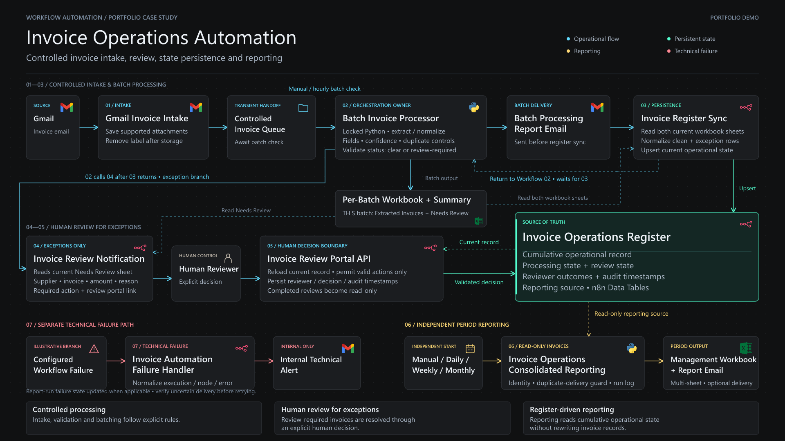
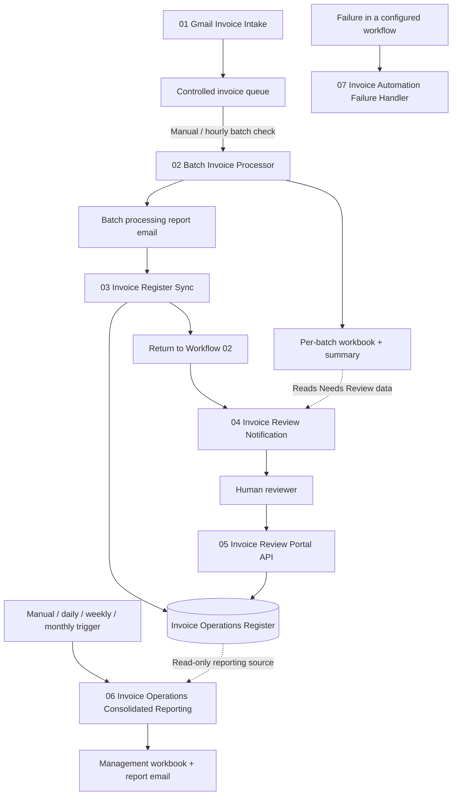

# Architecture

The project is organized as seven n8n workflows around a persistent Invoice Operations Register. The workflows are separated by responsibility so intake, processing, review, reporting, and failure handling can be tested and maintained independently.

## System topology

The diagram distinguishes workflow orchestration from shared data dependencies.

Workflow 02 owns the downstream batch sequence: after processing and the batch report, it runs Workflow 03 — Invoice Register Sync, waits for that sub-workflow to return, and then runs Workflow 04 — Invoice Review Notification. Workflow 03 does not invoke Workflow 04 directly.

Workflow 04 reads the current batch workbook for `Needs Review` records, then notifies a human reviewer. The reviewer opens Workflow 05 — Invoice Review Portal API from the notification link and records the decision there.

Workflow 06 — Invoice Operations Consolidated Reporting starts independently from its manual or scheduled triggers. It reads the Invoice Operations Register as a reporting source and does not modify invoice records.

## 1 — Gmail Invoice Intake

**Responsibility:** collect eligible invoice attachments and place them into the controlled processing queue.

The intake workflow:

1. watches Gmail for the configured invoice message condition;
2. splits supported attachments from the message;
3. saves each accepted attachment to the controlled queue;
4. removes the intake label only after the attachment is saved successfully.

Removing the label after successful storage prevents the same source message from being collected repeatedly.

The intake workflow does not perform invoice approval, accounting review, or payment actions.

## 2 — Batch Invoice Processor

**Responsibility:** coordinate the invoice-processing batch and route its resulting operational state.

The batch workflow can run manually or from its schedule. It first checks whether eligible files are present before starting the processor.

The processing path:

1. checks the controlled queue;
2. runs the locked Python invoice processor;
3. reads and validates the batch status;
4. generates the per-batch Excel workbook and summary output;
5. emails the processing report;
6. calls Invoice Register Sync;
7. calls Invoice Review Notification.

The batch status router distinguishes normal completion from states such as no new files, a locked batch, and unexpected statuses rather than treating every run as a successful processing event.

The processor also performs the extraction, normalization, required-field checks, confidence handling, and duplicate controls used to classify invoices as clear or review-required.

## 3 — Invoice Register Sync

**Responsibility:** persist the latest invoice-processing state.

The workflow reads the current per-batch workbook and separates two operational groups:

- clean invoice rows from `Extracted Invoices`;
- exception rows from `Needs Review`.

Both groups are normalized before being upserted into the Invoice Operations Register.

Typical clean state:

- `processing_status = Processed`
- `review_required = false`
- `review_status = Not Required`

Typical review-required state:

- `processing_status = Needs Review`
- `review_required = true`
- `review_status = Pending`

The register is cumulative. It is not the same thing as the latest batch workbook.

## 4 — Invoice Review Notification

**Responsibility:** notify a reviewer only about invoices that require human attention.

This workflow is called by the Batch Invoice Processor after the batch handoff. It reads the current workbook's `Needs Review` sheet, builds the reviewer-facing message, and sends the review notification for eligible exception records.

The notification includes operational context such as:

- supplier;
- invoice number when available;
- amount;
- review reason;
- required action;
- link to the controlled review portal.

The notification is not an approval. Its purpose is to surface the exception and direct the reviewer to the controlled decision interface.

## 5 — Invoice Review Portal API

**Responsibility:** provide the human decision boundary and persist validated review outcomes.

The portal has separate read and write behavior.

### Read path

The GET path:

1. receives a review reference;
2. loads the matching record from the Invoice Operations Register;
3. builds the review interface from the current stored state;
4. returns an actionable or read-only page.

A review is editable only while the stored record is in an actionable review state. Completed or otherwise closed reviews are presented as read-only.

### Decision path

The submission path reloads the current record before accepting a decision. The workflow validates the submitted action against the latest stored state and protects unrelated invoice fields during the update.

The demonstrated review path includes actions such as requesting correction. The resulting reviewer identity, decision state, and timestamps are persisted to the operational record.

This is the principal human-in-the-loop boundary of the system: automation prepares and routes the exception, but the reviewer records the accounting decision.

## 6 — Invoice Operations Consolidated Reporting

**Responsibility:** produce period-based operational reporting from the cumulative register.

This workflow is intentionally independent of the batch-processing path. It reads the Invoice Operations Register rather than reconstructing current state from processed files.

The reporting path:

1. receives a manual or scheduled report request;
2. builds a report identity and checks prior reporting runs;
3. blocks duplicate delivery when the same report should not be sent again;
4. reads Invoice Operations Register rows;
5. validates and prepares the selected reporting data;
6. writes a controlled JSON input for the Python report generator;
7. generates the consolidated workbook;
8. validates the generated status/result;
9. reads the workbook;
10. emails the report when delivery is enabled;
11. records the reporting-run result.

The verified implementation supports manual requests plus daily, weekly, and monthly scheduling.

The consolidated workbook contains separate operational views including:

- Summary;
- All Invoices;
- No Review Required;
- Needs Review;
- Completed Reviews;
- Exceptions;
- Technical Details.

The reporting workflow is read-only with respect to invoice records. Reporting must not change invoice review or processing state.

## 7 — Invoice Automation Failure Handler

**Responsibility:** surface technical workflow failures separately from normal invoice exceptions.

Configured workflows can route n8n execution failures into the centralized failure handler.

The handler:

1. receives the workflow error event;
2. normalizes workflow, execution, node, and error context;
3. identifies whether the failure belongs to consolidated reporting;
4. updates the reporting-run failure state when applicable;
5. sends an internal technical failure alert.

The failure alert includes enough execution context to investigate the failed node rather than silently swallowing the error.

A special control is used around reporting delivery: if a failure occurs after an email may already have been sent, the operator is instructed to verify delivery before retrying. This avoids treating blind retry as the default recovery mechanism.

## Operational state boundaries

### Controlled invoice queue

The queue is a transient handoff between Gmail intake and batch processing. It is not the long-term accounting record.

### Per-batch workbook

The batch workbook answers:

> What happened to the invoice files in this processing batch?

It contains extraction and review-routing results used by downstream batch workflows.

### Invoice Operations Register

The register is the cumulative operational source of truth used by review and consolidated reporting.

It stores the current invoice and review state, including corrections and reviewer outcomes. Reporting therefore reads the register rather than scanning the processed-invoice folder.

### Consolidated management workbook

The consolidated workbook answers:

> What is the current operational state of invoices for this reporting period?

It is a reporting output, not a transactional source of truth.

## Control boundaries

### Deterministic validation before review routing

Required fields, confidence checks, duplicate handling, and processing rules determine whether an invoice can remain in the clear path or must be surfaced for review.

### Human judgment is explicit

Review-required records do not become approved merely because extraction succeeded. The review portal provides the deliberate decision point.

### Review state is persistent

Reviewer actions are written back to the Invoice Operations Register so downstream reporting sees the current state rather than an earlier batch snapshot.

### Reporting is separated from transaction processing

The consolidated reporting workflow reads operational state but does not rewrite invoice records.

### Failure handling is separated from business exceptions

A missing invoice number is a review exception. A failed API/node execution is a technical failure. They are intentionally handled through different paths.

### Retry is not assumed to be safe

Where an external action may already have completed, the operator verifies state before retrying. This reduces the risk of duplicate email delivery or repeated downstream actions.

## Public repository boundary

This repository documents the architecture using sanitized screenshots, execution evidence, and short demonstrations.

The public package intentionally excludes:

- credentials and secrets;
- account identifiers;
- local execution URLs;
- environment-specific workflow IDs;
- local file-system paths;
- full n8n workflow exports.

Those details are implementation-specific and are not required to understand the system design.
