# Invoice Operations Automation

This project automates the operational work around receiving, processing, reviewing, and reporting on invoices.

Invoice emails enter through Gmail and are handed into a controlled processing flow. Invoice data is extracted and normalized, validation rules determine whether a record can continue automatically, and exception cases are held for human review instead of being treated as complete.

Review decisions are written back to the invoice register so the operational record reflects what actually happened. The system also produces a multi-sheet management report and includes dedicated failure monitoring for workflow errors.

The public repository focuses on architecture, execution evidence, review controls, and reporting. Environment-specific workflow exports and credentials are intentionally excluded.

## What this system handles

- Accepts invoice messages and attachments from Gmail
- Hands invoice files into the batch-processing path
- Extracts and normalizes invoice data
- Applies validation and duplicate checks before completion
- Separates invoices that can continue from invoices that require review
- Sends an internal review notification for exception cases
- Provides a browser-based human review step
- Records reviewer decisions and corrections in the invoice register
- Maintains an operational audit trail across processing and review
- Produces a consolidated management workbook with operational queues
- Monitors workflow failures separately from normal processing


## System flow

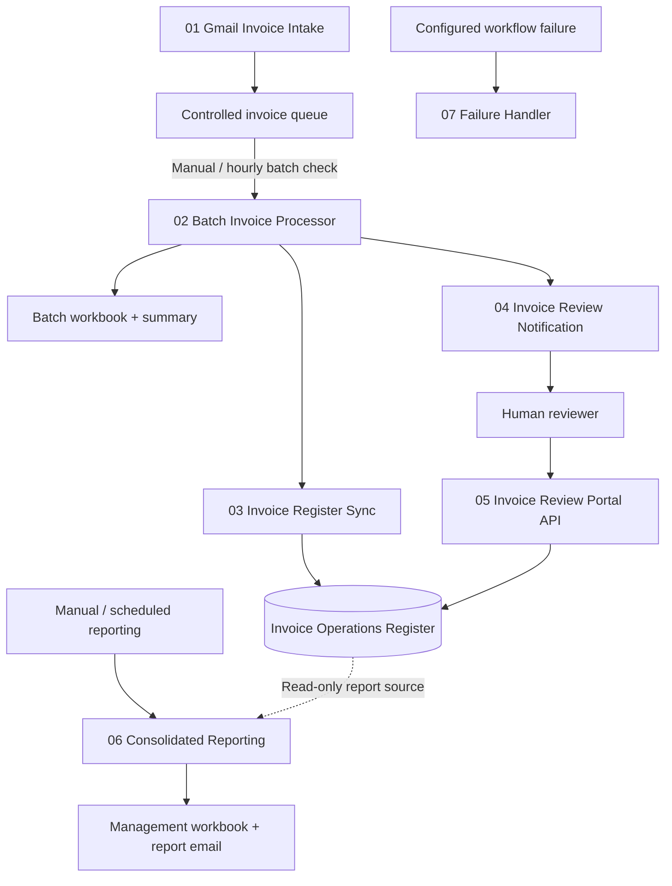

The Batch Invoice Processor owns the downstream batch handoff. After processing and the batch report, it runs Invoice Register Sync and then Invoice Review Notification. Workflow 03 does not invoke Workflow 04 directly.

The Invoice Operations Register is the persistent operational record used by human review and consolidated reporting. Reporting starts independently from its manual or scheduled triggers and reads the register without changing invoice records.

## Workflow structure

The implementation is divided into seven workflows rather than one large canvas. Each workflow owns a specific operational responsibility and can be inspected or tested independently.

### 01 — Gmail Invoice Intake

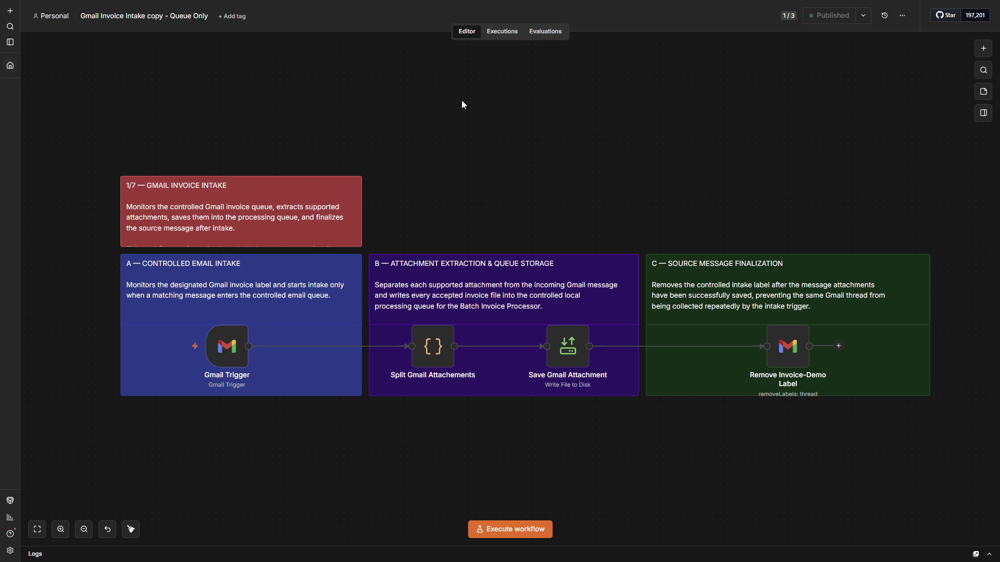

Watches the configured Gmail invoice condition, separates supported attachments, saves them into the controlled invoice queue, and removes the intake label only after storage succeeds.


### 02 — Batch Invoice Processor

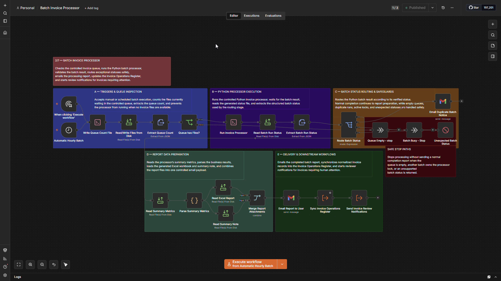

Checks the controlled invoice queue, runs the Python invoice processor, validates the batch result, produces the batch workbook and report email, then runs Invoice Register Sync followed by Invoice Review Notification.


### 03 — Invoice Register Sync

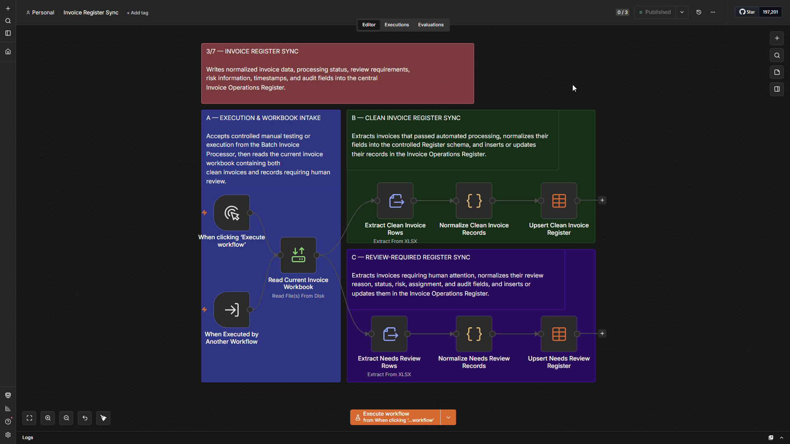

Reads the current batch workbook, separates clean and review-required invoice rows, normalizes both groups, and upserts their current state into the Invoice Operations Register.

### 04 — Invoice Review Notification

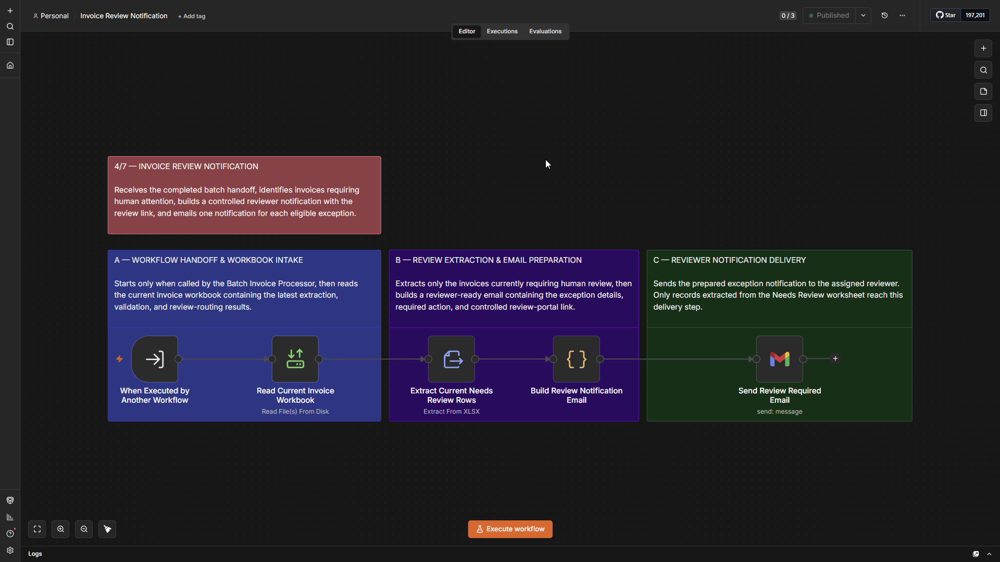

Reads the current `Needs Review` results, prepares the reviewer-facing exception notification, and provides a controlled link to the review record.

### 05 — Invoice Review Portal API

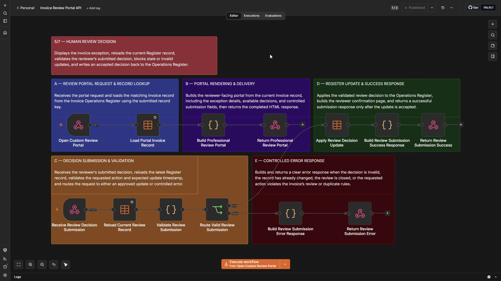

Provides the human decision boundary for invoices that cannot be completed automatically. The reviewer inspects the current stored record and submits a permitted decision; completed reviews become read-only.


### 06 — Invoice Operations Consolidated Reporting

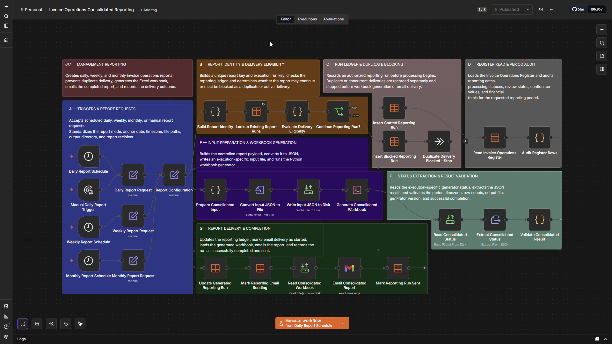

Runs independently from manual or scheduled report requests, reads the cumulative Invoice Operations Register, and produces a multi-sheet management workbook covering processing, review queues, completed reviews, exceptions, and technical detail.


### 07 — Invoice Automation Failure Handler

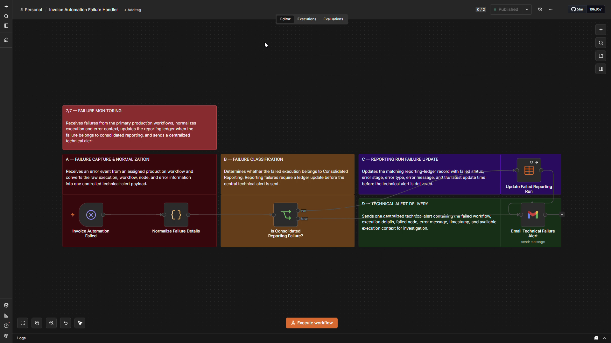

Receives failures from configured workflows, normalizes the execution context, records reporting failure state when applicable, and sends an internal technical alert without mixing system failures into invoice review logic.

## Controls and safeguards

### Validation before completion

Required fields, extraction confidence, duplicate checks, and processing rules are evaluated before an invoice is treated as clear. Records that do not meet those conditions are routed into the review path rather than silently marked complete.

### Duplicate classification and review

Duplicate handling is part of the invoice-processing controls. Duplicate-related records can be held for review, where the reviewer can explicitly approve the invoice as unique or confirm it as a duplicate.

### Human review for exceptions

Invoices requiring judgment are surfaced through the review notification and opened in the Invoice Review Portal API. The portal reloads the latest register record before accepting a decision and validates the submitted action against the current stored state.

Completed reviews become read-only so a closed decision is not casually overwritten.

### Persistent review state

Accepted reviewer decisions are written back to the Invoice Operations Register together with the resulting review state and audit timestamps. Downstream reporting therefore reflects the current persisted outcome rather than an earlier batch snapshot.

### Read-only consolidated reporting

The consolidated reporting workflow reads invoice and review state from the Invoice Operations Register but does not modify invoice records. Reporting remains separate from transaction processing and human review.

### Separate technical failure handling

Workflow execution failures are routed separately from normal invoice exceptions. The failure handler captures workflow, execution, failed-node, and error context and updates the reporting-run failure state when the failure belongs to consolidated reporting.

### Verify before retrying uncertain delivery

If consolidated reporting fails after the report email may already have been sent, the failure handler marks delivery as uncertain and instructs the operator to verify Gmail before retrying. This reduces the risk of sending the same management report twice.

## Demonstrated operation

The evidence below shows the working system across normal processing, exception handling, human review, audit persistence, and operational reporting.

### 1. Successful intake and processing

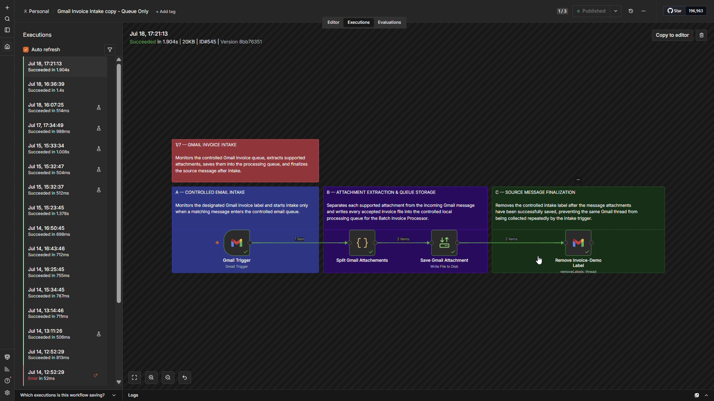

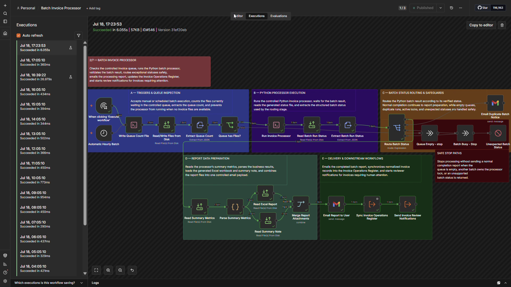


https://github.com/user-attachments/assets/954fa984-791d-447b-939b-fbca0de7195a


https://github.com/user-attachments/assets/5a06f71d-5f35-457d-8d44-43f8a563de4a


The intake and batch-processing evidence shows invoice files entering the controlled path and completing the processing handoff.

### 2. Batch result and review routing

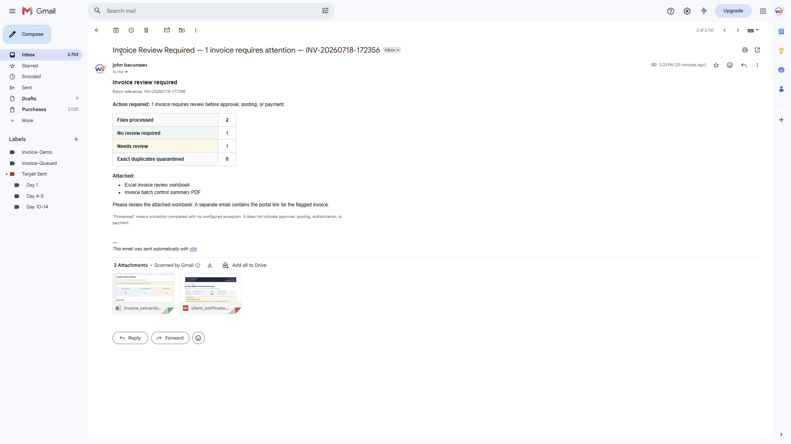

The batch result distinguishes clean invoices from records that require human review.

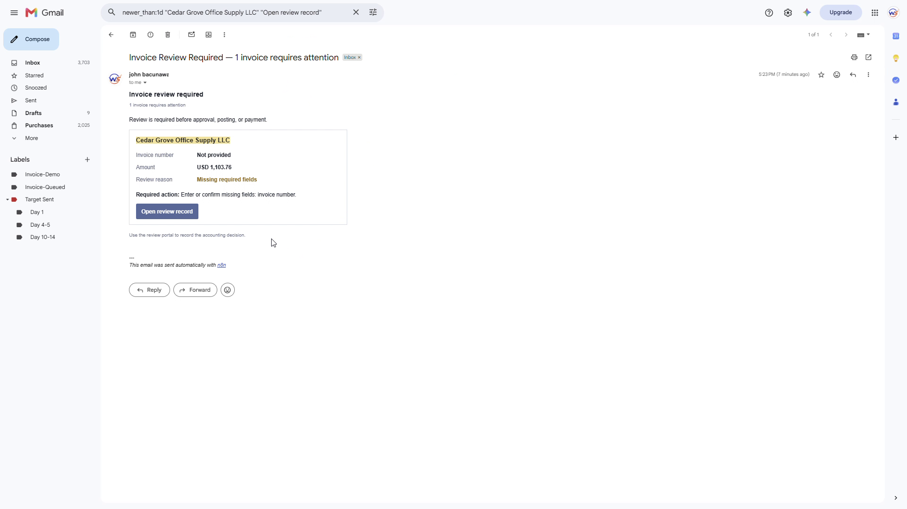

The review notification surfaces the exception and directs the reviewer to the controlled review interface.

### 3. Human review decision

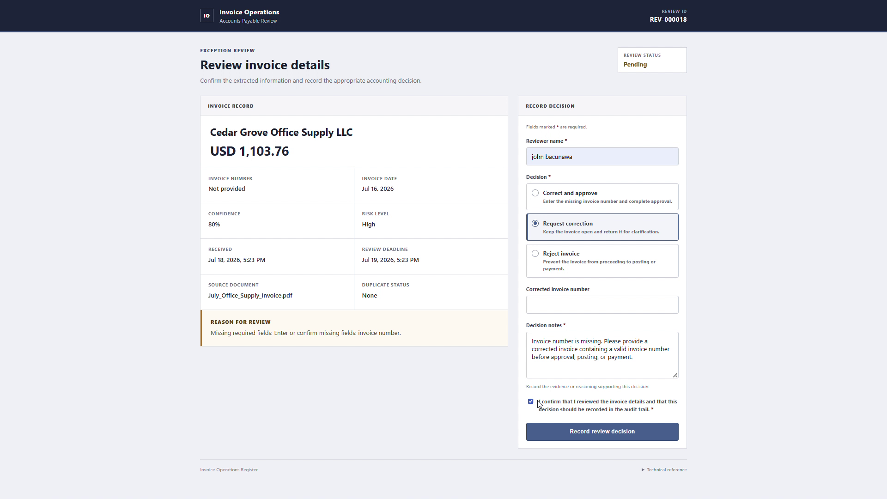

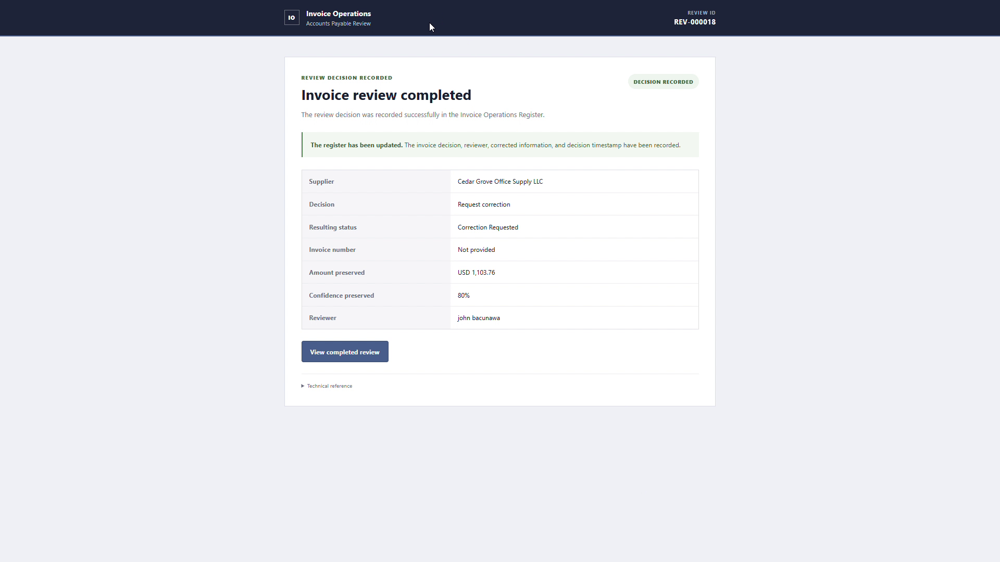


https://github.com/user-attachments/assets/21a69954-59b5-4d69-acef-079a0296d977


The reviewer works from the current stored record, submits a permitted decision, and the accepted result is recorded by the review workflow.

### 4. Audit state update

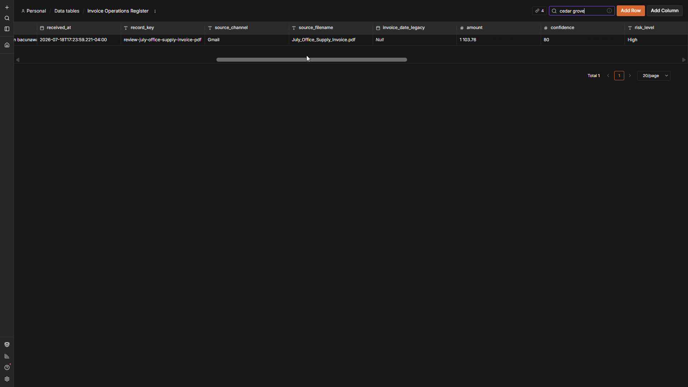


https://github.com/user-attachments/assets/91c374b6-dbb4-49bb-a45e-07f6d74f4288


The resulting review state is persisted to the Invoice Operations Register rather than existing only in the review page or notification email.

### 5. Consolidated management reporting

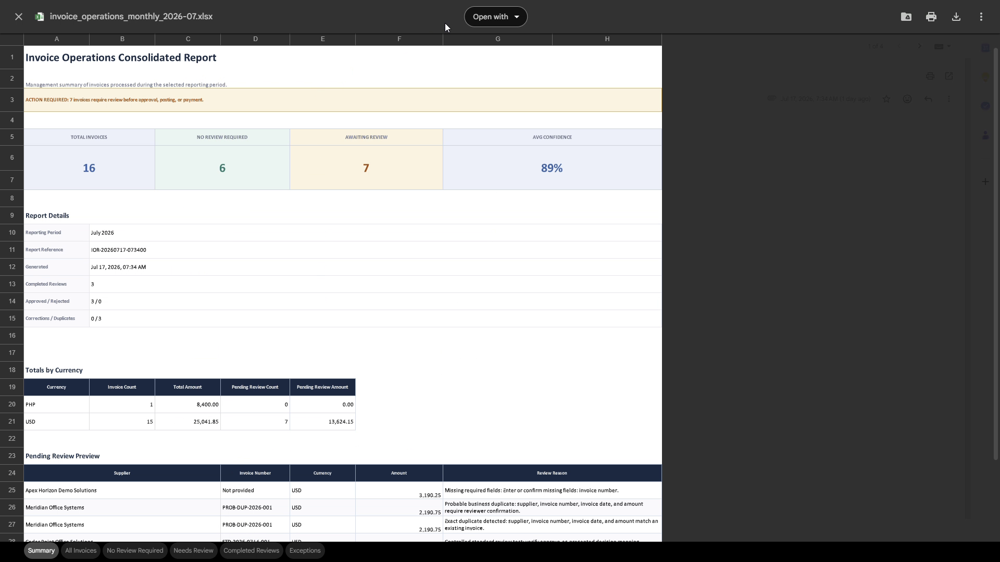

The consolidated workbook presents operational state across separate views rather than collapsing processing, review, and exceptions into one sheet.

| Reporting view | Evidence |
|---|---|
| No review required | [View screenshot](evidence/reporting/01-no-review-required.png) |
| Needs review queue | [View screenshot](evidence/reporting/02-needs-review-queue.png) |
| Completed reviews | [View screenshot](evidence/reporting/03-completed-reviews.png) |
| Exceptions and duplicate activity | [View screenshot](evidence/reporting/04-exceptions-and-duplicate-activity.png) |


https://github.com/user-attachments/assets/11ecfba0-3f47-4b4c-83e1-1cc8156a345a


## Technology

- **n8n** — workflow orchestration, scheduling, review routing, and failure handling
- **Python** — invoice extraction, normalization, validation, and report generation
- **Gmail** — invoice intake and internal operational notifications
- **Excel** — per-batch processing output and consolidated management reporting
- **JavaScript** — workflow-side transformation, validation, and state handling
- **n8n Data Tables** — persistent invoice, review, and reporting state
- **Webhooks / HTTP endpoints** — controlled browser review and workflow interaction

## Repository contents

```text
invoice-operations-automation/
├── README.md
├── ARCHITECTURE.md
├── DATA_DICTIONARY.md
├── evidence/
│   ├── workflows/
│   ├── execution/
│   └── reporting/
├── demos/
└── .gitignore
```

`evidence/workflows/` contains the seven workflow canvases. `evidence/execution/` contains proof of successful processing and the human-review path. `evidence/reporting/` contains the workbook views. `demos/` contains short sanitized recordings of selected system behavior.

## Documentation

- [Architecture](ARCHITECTURE.md) — workflow responsibilities, orchestration, shared state, and control boundaries
- [Data dictionary](DATA_DICTIONARY.md) — invoice, processing, review, audit, and reporting fields used by the system

## Public portfolio note

This repository is a sanitized technical portfolio of the invoice operations system.

It includes workflow architecture, execution evidence, human-review controls, reporting outputs, and selected short demonstrations.

Environment-specific n8n exports, credentials, local URLs, account identifiers, internal workflow IDs, and private configuration are intentionally excluded.
